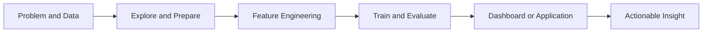

  

  

  
  
  

---

<h2 align="center">AI/ML Engineer | Data Science Intern | Computer Science Student</h2>

  

---

## About Me

I am **Kundan Pandey**, a final-year Computer Science student and Data Science Intern focused on practical AI. I build machine-learning and analytics applications that take a problem from raw data through exploration, modeling, evaluation, and a clear user-facing result.

### AI/ML and Data Science Focus

- Build classification and prediction workflows using Python, SQL, scikit-learn, and XGBoost
- Turn datasets into understandable dashboards and insights with Streamlit, Pandas, and visualization tools
- Create real-time interactive experiments with OpenCV, MediaPipe, and Pygame

### Engineering Philosophy

> A model is valuable only when its results are clear, reliable, and useful to people making decisions.

### What I Bring

- **End-to-end thinking** - from data preparation and feature engineering to evaluation and presentation
- **Practical delivery** - ML projects built as dashboards, web applications, or interactive experiences
- **Continuous learning** - currently deepening ML deployment, model evaluation, and SQL analytics

## What You Can Explore

| Area | What to expect |
| --- | --- |
| **Live portfolio** | A consolidated view of my technical profile, experience, projects, and downloadable resume. [Visit portfolio](https://kundan-portfolio-ten.vercel.app/) |
| **Machine learning apps** | Prediction workflows with preprocessing, model evaluation, and user-friendly Streamlit interfaces. |
| **Analytics projects** | SQL analysis and dashboards that translate customer and operational data into business insights. |
| **Computer vision** | Gesture-driven interactive applications using OpenCV and MediaPipe. |

### Current Focus

`ML Deployment` · `Feature Engineering` · `Model Evaluation` · `SQL Analytics` · `Applied Computer Vision`

## Technical Arsenal

### Machine Learning and Modeling

### Data Analytics and Visualization

### Computer Vision and Interactive Applications

### Development Workflow

## Project Portfolio

| Project | Problem solved | Stack |
| --- | --- | --- |
| [Customer Churn Analytics](https://github.com/kundanmrj5-dev/customer-churn-analytics-) | Churn prediction and analytics dashboard for surfacing customer-retention opportunities. | SQL, XGBoost, Streamlit |
| [Credit Card Approval Prediction](https://github.com/kundanmrj5-dev/credit-card-approval-ml) | Credit-approval prediction application built with a tuned logistic-regression pipeline. | Python, scikit-learn, Streamlit |
| [Wine Quality Prediction](https://github.com/kundanmrj5-dev/Wine-Quality-Prediction-Model) | Web application for predicting wine quality with a random-forest model. | Python, scikit-learn |
| [AI Fitness Coach](https://github.com/kundanmrj5-dev/AI-Fitness-Coach) | Personalized fitness and wellness platform with progress tracking and an AI coach. | JavaScript |
| [Gesture Hill Climb](https://github.com/kundanmrj5-dev/gesture-hill-climb-) | Webcam-controlled game powered by real-time hand-gesture recognition. | Python, OpenCV, MediaPipe, Pygame |

### Featured Links

- [View portfolio and download resume](https://kundan-portfolio-ten.vercel.app/)
- [Explore all GitHub repositories](https://github.com/kundanmrj5-dev?tab=repositories)

## Applied ML Workflow

## Credentials

- Machine Learning with Python - IBM
- SQL and Relational Databases - IBM
- TCS iON Career Edge - Interview and Job Readiness Program

---

## Let's Connect

  
  
  

